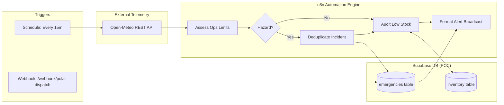

# Polar Command Center — n8n API Automation Workflow

**Integrated Polar Expedition Logistics & Asset Management System**  
National Polar Operations Platform · MoES / NCPOR

---

## 1. Overview

This directory contains an **importable n8n workflow** designed to automate backend telemetry, operational hazard detection, inventory audits, and incident reporting for **Polar Command Center**.



---

## 2. Workflow Capabilities

1. **Autonomous Station Telemetry Polling**:
   - Queries Open-Meteo multi-coordinate endpoint for **Maitri** (`-70.767, 11.733`), **Bharati** (`-69.407, 76.185`), and **Himadri** (`78.923, 11.928`).
   - Retrieves real-time temperature, apparent temperature (wind chill), wind gusts, and WMO weather codes.
2. **Polar Operational Safety Rules**:
   - Evaluates station conditions against `OPS_LIMITS`:
     - **GROUNDED**: Wind Gusts $\ge 74\text{ km/h}$ or Wind Chill $\le -45^\circ\text{C}$ (Severity: `CRITICAL`).
     - **HAZARDOUS**: Wind Gusts $\ge 56\text{ km/h}$ or Wind Chill $\le -35^\circ\text{C}$ (Severity: `HIGH`).
     - **MARGINAL**: Wind Gusts $\ge 39\text{ km/h}$ or Wind Chill $\le -25^\circ\text{C}$ (Severity: `MEDIUM`).
3. **Smart Incident Deduplication**:
   - Before inserting an emergency into Supabase, queries `GET /rest/v1/emergencies?status=in.(ACTIVE,RESPONDING)&type=eq.WEATHER&location_id=eq.[STATION_ID]`.
   - Suppresses redundant alerts if an active weather incident is already open for that station.
4. **Supabase Auto-Incident Creation**:
   - Automatically issues authenticated `POST /rest/v1/emergencies` with proper PCC schema format (`INC-XXXX`, station metadata, timestamps, and assigned response team).
5. **Periodic Inventory Level Audits**:
   - Fetches all inventory records from Supabase (`GET /rest/v1/inventory?select=*`).
   - Flags items where `quantity <= minimum_quantity` (e.g. rations, spare parts, medical supplies, fuel) for automated replenishment dispatch.
6. **On-Demand Webhook Dispatch**:
   - Listens on `/webhook/polar-dispatch` (or `/webhook-test/polar-dispatch`) for instant manual or field satphone incident logging.

---

## 3. Quickstart: Running n8n

### Option A: Using Docker Compose (Recommended)

Run n8n in a lightweight container with credentials pre-injected:

```bash
cd n8n
docker compose up -d
```

Open your browser at **http://localhost:5678**.

### Option B: Using npx (Zero Installation)

```bash
npx n8n
```

### Option C: Using Docker directly

```bash
docker run -it --rm \
  --name n8n \
  -p 5678:5678 \
  -e SUPABASE_URL="https://your-project.supabase.co" \
  -e SUPABASE_ANON_KEY="your-supabase-anon-key" \
  -v ~/.n8n:/home/node/.n8n \
  docker.n8n.io/n8nio/n8n:latest
```

---

## 4. How to Import the Workflow

1. Open n8n in your browser at `http://localhost:5678`.
2. In the left navigation, click **Workflows**.
3. Click the **+ Add Workflow** button (or press `Ctrl/Cmd + N`).
4. In the top-right corner of the canvas, click the **three dots menu (`...`)** and select **Import from File...**.
5. Select the file:
   ```
   n8n/polar-command-center-workflow.json
   ```
6. The workflow will appear on your canvas with all 14 interconnected nodes ready to use.

---

## 5. Configuring Credentials & Environment

The workflow utilizes standard environment variables:
- `SUPABASE_URL`: Your Supabase project URL (e.g. `https://xyzproject.supabase.co`).
- `SUPABASE_ANON_KEY`: Your Supabase anon public key or service role key.

### Where to enter them:
1. **Via Environment / Docker**: In your `.env` or `docker-compose.yml`.
2. **Directly in n8n**:
   - Double-click the Supabase nodes:
     - `Check Existing Active Weather Incidents`
     - `POST New Incident to Supabase`
     - `Fetch Inventory from Supabase`
     - `Insert Webhook Incident to Supabase`
   - In the **URL** and **Header (apikey / Authorization)** fields, enter your Supabase URL and Key directly.

---

## 6. Testing & Verifying the Automation

### Test 1: Test Weather Telemetry & Hazard Evaluation
1. In n8n, click the **Fetch Polar Weather Telemetry** node.
2. Click **Test step** (or **Execute node**).
3. Confirm that live weather data from Open-Meteo is retrieved for Maitri, Bharati, and Himadri.
4. Next, execute **Assess Ops Limits & Detect Hazards** to see the calculated severity, operational limits, and hazard evaluation.

### Test 2: Test On-Demand Incident Ingestion Webhook
Send a simulated incident report via `curl` to n8n's webhook URL:

```bash
curl -X POST http://localhost:5678/webhook-test/polar-dispatch \
  -H "Content-Type: application/json" \
  -d '{
    "type": "EQUIPMENT_FAILURE",
    "location": "Maitri Station Generator Bay",
    "location_id": "LOC-MAITRI",
    "severity": "CRITICAL",
    "description": "Auxiliary turbine shutdown due to coolant line freeze.",
    "assigned_team": "Maitri Technical Response"
  }'
```

### Test 3: Test Inventory Stock Audit
1. Execute the **Fetch Inventory from Supabase** node.
2. Step through to **Audit Low-Stock Levels**.
3. The node outputs any stock items where current quantity is below the minimum safe threshold along with deficit amounts.

---

## 7. Connecting to the Polar Command Center Frontend

When an incident is inserted into Supabase by n8n:
- The Polar Command Center frontend dashboard instantly reflects it in the **Active Emergencies** banner and alert badge.
- If Supabase realtime listeners are enabled, the incident appears live on the map without requiring a browser reload.
